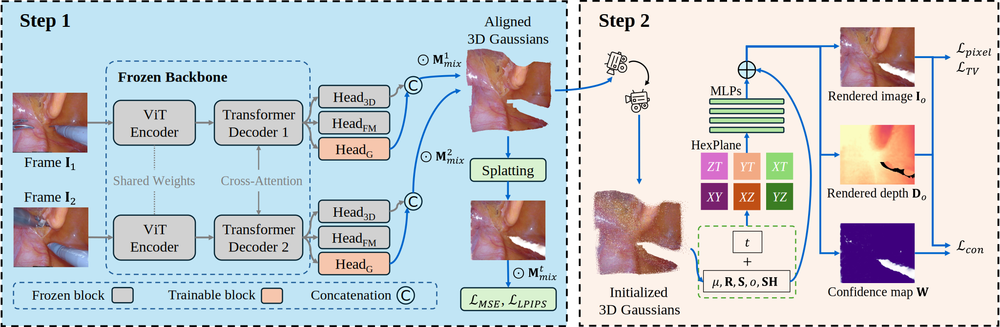

<div align="center">

# Endo-PairGS: pair priors for dynamic endoscopic scene reconstruction

**Xiankang Yu, Yuichiro Hayashi, Masahiro Oda, Takayuki Kitasaka, Kensaku Mori**

**Nagoya University**

<a href='https://doi.org/10.1007/s11548-026-03707-y'></a>



-----

 

<video src="https://github.com/user-attachments/assets/52ae7500-accf-4fbf-89d8-d7e06c731a29" controls="true" width="100"></video> 

-----

 

<video src="https://github.com/user-attachments/assets/0ed6063b-1a57-401a-88f3-f140cc193130" controls="true" width="100"></video>

-----

 

<video src="https://github.com/user-attachments/assets/3f880201-7ad3-45b1-b636-f0a1fd172a3e" controls="true" width="100"></video>


</div>

Offical implementation of `Endo-PairGS: pair priors for dynamic endoscopic scene reconstruction`, a self-supervised framework for dynamic endoscopic scene reconstruction.

## Installation

Please follow [Splatt3R](https://github.com/btsmart/splatt3r) and [Endo-4DGS](https://github.com/lastbasket/Endo-4DGS) to install the python environments for training.

**Must to install them in seperated conda environments for two-stage training**

## Data and pre-trained weights

### Datasets
All the Training datasets can be download from [GoogleDrive](https://drive.google.com/file/d/1lFwRYz09gr7UjQTy3ed1jboaBD2wM2oR/view?usp=sharing). The camera extrinsics is stored [LLFF](https://github.com/fyusion/llff) format. You can follow this to make your own datasets.

### Pre-trained Weight

This is the fine-tuned weight of Splatt3R ([GoogleDrive](https://drive.google.com/file/d/1L0DHx3uPYTq_xm9EI8a2vux4cIRK64zU/view?usp=sharing)) on Endoscopic data. you can use this to generate paired 3D point cloud for dynamic recosntruction.

## Training

### Step 1

1. Prepare the training data and split them in folders like the format in `splits/endonerf`.
2. Download Splatt3R pre-trained [weight](https://huggingface.co/brandonsmart/splatt3r_v1.0/tree/main) to `./checkpoints/` folder.
3. Run the follow scripts in `run.sh`.
```shell
CUDA_VISIBLE_DEVICES=0 python main.py configs/main.yaml
```

### Step 2
1. To generate aligned paired 3D point cloud used the model in Step 1.
```shell
CUDA_VISIBLE_DEVICES=0 python predict_3D.py configs/predict.yaml
```
2. Use the Endo-4DGS model in `\endo4dgs\train.sh` for dynamic reconstruction.
```shell
# chnage the data path and output path in your device.
cd ./endo4dgs
CUDA_VISIBLE_DEVICES=0 PYTHONPATH='.'  python train.py -s /suedata1/Free/xkangyu/data/dynamic_endo_scene/cutting_tissues_twice --port 6017 --expname "endonerf/cutting" --configs arguments/endonerf.py
```

## Evaluation
1. Generate the 2D image of Step 1
```shell
CUDA_VISIBLE_DEVICES=0 python predict_2D.py configs/predict.yaml
```
2. Generate dynamic reconstructed results in `\endo4dgs\render.sh`.
```shell
cd ./endo4dgs
CUDA_VISIBLE_DEVICES=0 python render.py --model_path "/suedata1/Free/xkangyu/mycodes/splatt3r_gs/output/endonerf/pulling_split3r" --pc --skip_video --skip_train --configs arguments/endonerf.py -s /suedata1/Free/xkangyu/data/dynamic_endo_scene/pulling_soft_tissues
```
3 After render the results, you can evaluate the metrics in `\endo4dgs\eval.sh`.
```shell
python metrics.py --model_path "/suedata1/Free/xkangyu/mycodes/splatt3r_gs/output/endonerf/pulling_split3r"
```

## Citation
```
@article{yu2026endopairgs,
      title={Endo-PairGS: pair priors for dynamic endoscopic scene reconstruction}, 
      author={Yu, Xiankang and Hayashi, Yuichiro and Oda, Masahiro and Kitasaka, Takayuki and Mori, Kensaku},
      journal={International Journal of Computer Assisted Radiology and Surgery},
      year={2026},
      url={https://doi.org/10.1007/s11548-026-03707-y}, 
}
```
## Access
If you have any question, please new a issues or [email](mailto:yin950429@hotmail.com) me.

